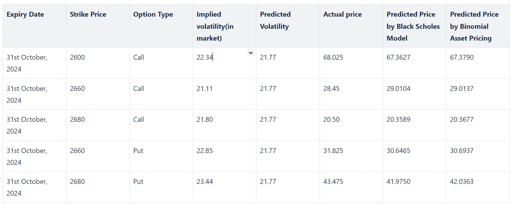

# Computational Finance Project (CS 515)

This repository contains the implementation and analysis of various financial option pricing models as part of the **Computational Finance Course (CS 515)** for Fall 2024. The project focuses on applying theoretical concepts in finance through data-driven methods using Python. It covers techniques for estimating historical volatility, implementing the Black-Scholes model, and the Binomial model for pricing European options.

## Table of Contents

- [Project Overview](#project-overview)
- [Installation](#installation)
- [Data Collection](#data-collection)
- [Components](#components)
    - [1. Historical Volatility Calculation](#1-historical-volatility-calculation)
    - [2. Black-Scholes Model](#2-black-scholes-model)
    - [3. Binomial Model](#3-binomial-model)
- [Usage](#usage)
- [Results](#results)
- [References](#references)

## Project Overview

The aim of this project is to explore different models for pricing options and estimating volatility, specifically:

1. **Data Collection**: Using [yfinance API](https://pypi.org/project/yfinance/) to fetch historical stock data for Reliance (Reliance.NS).
2. **Historical Volatility Calculation**: Implementing `Standard Deviation`, `Parkinson`, `Garman Klass` and `EWMA` to calculate historical volatility.
3. **Option Pricing Models**: Implementing the `Black-Scholes Model` and `Binomial Model` to price European options based on the collected stock data.

## Installation

To run the project, clone the repository and install the required packages using the command:

```bash
pip install -r requirements.txt
```

## Data Collection

The stock price data is fetched via the **Yahoo Finance** API using the `yfinance` Python library. The default stock symbol used is **Reliance.NS** (Reliance Industries Limited, India) for this notebook. This can be adjust by ticker as desired for other stocks.

```python
ticker = "RELIANCE.NS"
reliance_stock = yf.Ticker(ticker)
df = reliance_stock.history(interval="1d", period="1y")
```

## Components

### 1. Historical Volatility Calculation

#### Methods Used:

- **Standard Deviation**: Computes volatility based on the sample standard deviation of log returns.
- **Parkinson**: A high-low estimator that incorporates intra-day price ranges to estimate volatility.
- **Garman-Klass**: Combines both the high-low and open-close prices for a more refined estimate.
- **EWMA (Exponentially Weighted Moving Average)**: Uses a smoothing parameter to assign more weight to recent data.


### 2. Black-Scholes Model

The **Black-Scholes Model** is a continuous-time model used to price European call and put options based on stock volatility, strike price, time to expiration, and other key factors.

#### Usage:
```python
call_price, put_price = black_scholes(S=stock_price, K=2600, T=0.5, r=0.06, sigma=0.22)
```

### 3. Binomial Model

The **Binomial Model** uses a binomial tree to model potential future stock prices and evaluates the price of an option by stepping backward through the tree.

#### Usage:
```python
call_price_binomial, put_price_binomial = binomial_option_prices(S=stock_price, K=2600, T=0.5, r=0.06, sigma=0.22, steps=100)
```


## Usage

1. Clone the repository and navigate to the project directory.
2. Run the Jupyter notebook to see the models, and graphs.

## Results

The project includes visualizations comparing the different volatility estimates and resulting option prices calculated using the Black-Scholes and Binomial models.

1. **Volatility Analysis**  
   - Examining the option chain for Reliance options expiring on October 31, 2024, we find that the implied volatility (IV) for at-the-money options is approximately 21-23%. This reflects the market's expectation of future price fluctuations based on supply, demand, and current option pricing.
   - To further validate and compare this with our calculated volatility measures, we utilized several statistical methods:

      - **Standard Deviation Method**: Calculated annualized volatility is approximately 21.78%, aligning closely with market IV, indicating that recent price movements reflect market-expected variability.

      - **Parkinson’s Volatility**: Estimated at 18.66%, below the IV range, suggesting that highs and lows alone may not fully capture short-term fluctuations influencing near-term option pricing.

      - **Garman-Klass Volatility**: Estimated at 18.51%, similar to Parkinson’s, suggesting that incorporating opening and closing prices may still underestimate short-term market risks.

      - **Exponentially Weighted Moving Average (EWMA)**: Estimated at 20.06%, aligning more closely with the IV range, capturing recent price volatility and suggesting alignment with near-term market expectations.

   - **Summary**: Each method provides a unique perspective on historical volatility, with Standard Deviation and EWMA methods closer to the lower end of the IV range, while Parkinson and Garman-Klass estimates are lower. This comparison suggests that market participants expect slightly higher future volatility than historical estimates alone, capturing potential near-term risks and uncertainties.

2. **Comparative Analysis**  
   - A graph shows the option prices estimated through Black-Scholes and Binomial models across various parameters.
   ")

3. **Option Price Estimates**  
   - A table shows the predicted option prices in comparison with the actual ones.
   
   - **Convergence of Models**: The analysis demonstrates a consistent convergence between the Binomial and Black-Scholes models across all tested volatility methods. This suggests that both models are robust in various market scenarios and can reliably predict option prices when using appropriate volatility estimates.

   - **Impact of Volatility Estimates**: The choice of volatility calculation method has a significant impact on the predicted option prices. Higher volatility estimates (like standard deviation and EWMA) lead to higher option prices, while lower estimates (like Parkinson and Garman-Klass) result in lower prices. This indicates the critical role that volatility plays in option pricing, with traders needing to be mindful of the methods used to derive these estimates.

   - **Practical Application**: Understanding how different volatility measures affect option pricing allows traders to better assess their strategies. They can choose the volatility method that aligns with their market outlook, enhancing decision-making in option trading.

   - **Market Dynamics Reflection**: The analysis emphasizes that options pricing is highly sensitive to market conditions and volatility estimates. The closer the volatility reflects current market sentiments, the more accurately the predicted prices will represent the true option value.

In conclusion, the study highlights the nuanced relationship between volatility estimates and option pricing, illustrating how the choice of model and calculation method can significantly influence trading decisions. Traders should consider these factors when evaluating options, ensuring they apply the most appropriate volatility model for their market analysis.


## References

- Black, F., & Scholes, M. (1973). "The Pricing of Options and Corporate Liabilities." *Journal of Political Economy.*
- Parkinson, M. (1980). "The Extreme Value Method for Estimating the Variance of the Rate of Return." *Journal of Business.*
- Garman, M. B., & Klass, M. J. (1980). "On the Estimation of Security Price Volatilities from Historical Data." *Journal of Business.*
